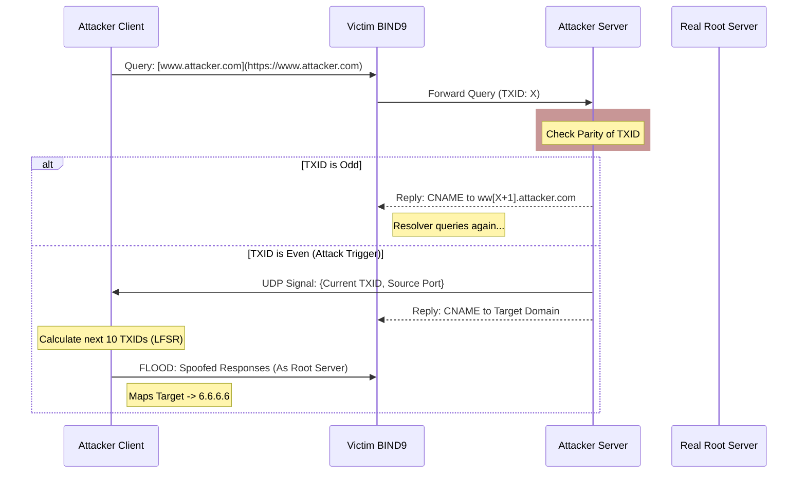

# 🌐 BIND9 DNS Cache Poisoning Exploit

> **Course:** 67607 (Cyber Security) - Exercise 2
> **Authors:** Yael Batat & Shir Babian

This project implements a **DNS Cache Poisoning attack** targeting the BIND9 DNS resolver (specifically version 9.4.1). The exploit demonstrates the vulnerability described by Amit Klein (2007), leveraging predictable Transaction IDs (TXID) to inject malicious records into the resolver's cache.

## 🎯 Objective
To force the vulnerable BIND9 resolver to cache a false IP address (`6.6.6.6`) for the domain `www.example.cybercourse.com`, effectively redirecting traffic to a malicious destination.

## 🧠 The Vulnerability
The attack exploits two main weaknesses in older BIND9 versions:
1.  **Predictable TXID Generation:** The Transaction ID generation relies on a Linear Feedback Shift Register (LFSR) which can be mathematically predicted.
2.  **Static Source Ports:** The resolver uses fixed UDP source ports for outgoing queries, reducing the entropy needed to spoof a response.

## ⚙️ Architecture & Attack Flow

The attack is composed of two synchronized components running in a Dockerized environment:

1.  **Attacker's Name Server (`ex2_server.c`):** Serves as the authoritative server for the attacker's domain. It acts as a "sensor" to analyze incoming TXIDs from the victim resolver.
2.  **Attacker's Client (`ex2_client.c`):** Performs the calculation and executes the spoofing attack using Raw Sockets.

### Attack Sequence



## 🛠️ Technical Implementation

### 1. The Server (`ex2_server.c`)
* Listens on port `53` using standard sockets.
* **Parity Check:** Analyzes the parity of the incoming Transaction ID (TXID).
* **Synchronization:** When an **even** TXID is detected, it sends the TXID and the resolver's port to the Attacker Client via a private UDP channel. This creates the window of opportunity for the spoofing.

### 2. The Client (`ex2_client.c`)
* **LFSR Prediction:** Implements the algorithm to predict the next 10 pseudo-random Transaction IDs based on the leaked state.
* **Raw Sockets:** Uses `SOCK_RAW` to construct custom UDP/IP packets from scratch.
* **Spoofing:**
    * Fabricates DNS responses appearing to come from the Root Server (`192.168.1.204`).
    * Calculates correct IP and UDP checksums manually.
    * Sets the Answer Record to `6.6.6.6`.

## 🚀 Usage

### Prerequisites
* Linux Environment (with `root` privileges for Raw Sockets).
* **Libraries:** `ldns`, `libpcap`.
* **Docker environment** (as defined in the course lab).


### Compilation
Compile both components using GCC:

```bash
# Compile the Attacker Client
gcc -Wall -Wextra -Werror ex2_client.c -lldns -lpcap -o attacker_client

# Compile the Attacker Server
gcc -Wall -Wextra -Werror ex2_server.c -lldns -lpcap -o attacker_server
```
### Execution
1. **Start the Server:** Run the authoritative server to listen for incoming DNS queries.
2. **Run the Client:** Execute the client to trigger the initial query and wait for the synchronization signal to launch the spoofed packets.

## 📂 File Structure
* `ex2_client.c` - Implements LFSR prediction, Raw Sockets, and packet injection.
* `ex2_server.c` - Implements the malicious DNS server logic and parity analysis.
* `explanation.txt` - In-depth breakdown of the assembly and logic.

## ⚠️ Disclaimer
This software was developed for educational purposes as part of the Cyber Security course at the Hebrew University of Jerusalem. It demonstrates a known vulnerability in legacy software. **Do not use this code against production systems.**
